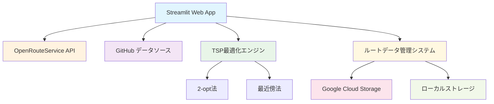

# ポスター掲示板ルート最適化ツール

[](https://github.com)
[](https://docker.com)
[](https://cloud.google.com/run)

ポスター掲示板の巡回ルートを最適化するWebアプリケーションです。巡回セールスマン問題（TSP）アルゴリズムを使用して、投票区毎に効率的な巡回順序を計算し、Google Mapsでナビゲーション可能なリンクを生成します。

## ✨ 主要機能

### 🎯 最適化機能
- **投票区毎の最適化**: 各投票区内で独立してルート最適化
- **TSP最適化**: 2-opt法 + 最近傍法による高度な最適化
- **道路距離対応**: OpenRouteService APIによる実際の道路距離計算
- **徒歩ナビゲーション**: Google Maps連携で徒歩ルート表示

### 💻 ユーザーインターフェース
- **Streamlit Webアプリ**: 直感的なブラウザインターフェース
- **リアルタイム進捗**: 最適化処理の進捗をリアルタイム表示
- **詳細データ表示**: 投票区毎の地点詳細（緯度経度含む）
- **エラーハンドリング**: 座標エラーの詳細表示と対処方法

### 🔄 データ管理
- **GitHub連携**: team-mirai-volunteer/action-board からの自動データ取得
- **GCS/ローカル対応**: 本番はGCS、開発はローカルストレージ
- **階層構造保存**: `storage/routes/都道府県/市区町村.json` 形式

## 📦 プロジェクト構成

```
route_optimizer/
├── app/
│   ├── streamlit_app.py      # メインUIアプリケーション
│   ├── tsp_solver.py         # TSP最適化アルゴリズム
│   ├── route_optimizer.py    # ルート最適化エンジン
│   ├── data_manager.py       # GitHubデータ管理
│   ├── storage_manager.py    # GCS/ローカルストレージ
│   └── utils.py              # 共通ユーティリティ
├── storage/                  # ローカルストレージ
│   └── routes/              # ルートデータ保存先
│       └── 都道府県/         # 都道府県別フォルダ
│           └── 市区町村.json # 最適化結果ファイル
├── venv/                    # Python仮想環境
├── .streamlit/
│   └── config.toml          # Streamlit設定
├── .env.example             # 環境変数テンプレート
├── .gitignore              # Git除外設定
├── Dockerfile              # 本番用Docker設定
├── DEPLOYMENT.md           # デプロイガイド
├── Makefile               # 運用コマンド
├── requirements.txt       # Python依存関係
└── README.md             # このファイル
```

## 🏗️ アーキテクチャ

### システム構成



### コンポーネント
- **streamlit_app.py**: Webインターフェースとユーザー操作
- **tsp_solver.py**: TSPアルゴリズム（2-opt + 最近傍法）
- **route_optimizer.py**: 最適化エンジンとAPI通信
- **data_manager.py**: GitHubからのリアルタイムデータ取得
- **storage_manager.py**: GCS/ローカルストレージ管理
- **utils.py**: 共通関数と定数定義

### データフロー
1. **データ取得**: GitHubから都道府県・市区町村CSVを自動取得
2. **座標検証**: 緯度経度の妥当性チェックとエラー表示
3. **最適化処理**: 投票区毎にTSP（2-opt + 最近傍法）でルート計算
4. **距離計算**: OpenRouteService APIで道路距離を取得（Rate Limit対応）
5. **結果保存**: GCS（本番）またはローカル（開発）に階層構造で保存
6. **ナビゲーション**: Google Maps徒歩ルートリンク生成

## 🛠️ ローカル開発環境のセットアップ

### 1. 仮想環境のアクティベート

```bash
cd route_optimizer
source venv/bin/activate  # macOS/Linux
# または
# venv\Scripts\activate  # Windows
```

### 2. 依存関係のインストール（初回のみ）

```bash
pip install -r requirements.txt
```

### 3. 環境変数の設定（任意）

```bash
# 環境変数ファイルをコピー
cp .env.example .env

# .envファイルを編集して必要な値を設定
# 例: GOOGLE_CLOUD_PROJECT, GCS_BUCKET_NAME など
```

#### 環境変数の詳細

- **GCS_BUCKET_NAME**: Google Cloud Storageのバケット名（本番環境で必須）
- **GOOGLE_CLOUD_PROJECT**: Google Cloud プロジェクトID
- **STREAMLIT_SERVER_PORT**: Streamlitサーバーのポート番号（デフォルト: 8501）

### 4. アプリケーションの起動

```bash
streamlit run app/streamlit_app.py
```

アプリケーションは [http://localhost:8501](http://localhost:8501) でアクセス可能になります。

### 5. 仮想環境の無効化（作業終了時）

```bash
deactivate
```

## 🚀 クイックスタート

### 本番環境でのデプロイ

詳細は [DEPLOYMENT.md](DEPLOYMENT.md) を参照してください。

```bash
# 1. リポジトリクローン
git clone <repository-url>
cd poster-map/route_optimizer

# 2. 環境設定
cp .env.example .env
# .env ファイルを編集して本番設定を入力

# 3. Dockerで起動
docker build -t route-optimizer:latest .
docker run -d --env-file .env -p 8501:8501 route-optimizer:latest
```

### 使い方

1. **📁 最適化済みルート**: 保存済みのルートを都道府県・市区町村別に閲覧
2. **🆕 新規最適化**: 
   - OpenRouteService APIキーを入力
   - 都道府県・市区町村を選択（GitHubから自動取得）
   - 最適化を実行してGoogle Mapsリンクを生成

### OpenRouteService APIキー取得

1. [OpenRouteService](https://openrouteservice.org/) でアカウント作成
2. [API Key管理ページ](https://openrouteservice.org/dev/#/home) でキー取得
3. 制限: 1分間40リクエストまで

## 🐳 Docker

### ローカルでのDocker実行

```bash
# Dockerイメージのビルド
make build

# ローカルでの実行
make run

# 環境変数を使用した実行
GCS_BUCKET_NAME="your-bucket" GOOGLE_CLOUD_PROJECT="your-project" make run-local
```

### Google Cloud Runへのデプロイ

#### 前提条件

- Google Cloud SDKがインストールされていること
- Google Cloud プロジェクトが設定されていること
- Artifact Registryが有効になっていること

#### 権限設定

Cloud Runサービスアカウントに以下の権限が必要です：

```bash
# Cloud Storageへのアクセス権限
gcloud projects add-iam-policy-binding PROJECT_ID \
    --member="serviceAccount:SERVICE_ACCOUNT_EMAIL" \
    --role="roles/storage.objectAdmin"
```

#### デプロイの実行

```bash
make deploy
```

## ⚙️ 技術スタック

### フロントエンド
- **Streamlit 1.33.0**: Webアプリケーションフレームワーク
- **pandas 2.0.3**: データ処理
- **numpy 1.24.3**: 数値計算

### バックエンド
- **Python 3.11**: プログラミング言語
- **TSPソルバー**: 2-opt法 + 最近傍法
- **OpenRouteService API**: 道路距離計算
- **Google Cloud Storage**: 本番データストレージ

### インフラ
- **Docker**: コンテナ化
- **Google Cloud Run**: サーバーレスデプロイ
- **GitHub Actions**: CI/CD（オプション）

### アルゴリズム詳細
```python
# TSP最適化プロセス
1. 最近傍法で初期解生成
2. 2-opt法で局所最適化（最大50回）
3. 改善閾値1%で収束判定
4. 投票区毎に独立処理
```

## 🔧 トラブルシューティング

### 🌐 API関連エラー

**OpenRouteService APIエラー**
```bash
# エラー例
❌ API通信エラーが発生しました

# 対処方法
1. APIキーの確認（10文字以上必要）
2. Rate Limit確認（40req/min）
3. ネットワーク接続確認
```

**GitHub データ取得エラー**
```bash
# 症状: 都道府県一覧が表示されない
# 対処: ネットワーク接続とGitHubアクセス確認
```

### 💾 ストレージ関連

**GCS接続エラー**
```bash
# エラー例
⚠️ GCS接続エラー: ローカルストレージを使用します

# 対処方法
1. GCS_BUCKET_NAME環境変数確認
2. サービスアカウントキー確認
3. バケットアクセス権限確認
```

### 🧮 最適化関連

**座標エラー**
```bash
# エラー例
❌ 座標エラーが3件あります

# 対処方法
1. エラー詳細を展開して確認
2. 緯度: -90〜90, 経度: -180〜180の範囲確認
3. CSVデータの修正
```

**メモリ不足**
```bash
# 症状: 大量地点処理時のエラー
# 対処: Docker/Cloud Runのメモリ制限引き上げ
```

## 🚀 本番運用ガイド

### 監視項目
- **レスポンス時間**: 95%tile < 30秒
- **エラー率**: < 1%
- **リソース使用率**: CPU < 80%, Memory < 80%

### スケーリング
- **Cloud Run**: 自動スケーリング（0-10インスタンス）
- **メモリ**: 推奨2GB以上
- **CPU**: 推奨2vCPU以上

### セキュリティ
- **非rootユーザー**: Docker実行
- **CORS/XSRF**: 保護有効
- **APIキー**: 環境変数管理
- **ログ**: 機密情報マスキング

## 📌 注意事項

- OpenRouteService APIは制限があります（40リクエスト/分）
- 大量データ処理時は、Cloud Runのタイムアウト設定に注意してください
- 処理中はブラウザを閉じないでください
- 本番環境ではGCS使用を推奨します

## 📈 パフォーマンス

### ベンチマーク
- **小規模**: 10地点以下 - 5秒以内
- **中規模**: 11-25地点 - 30秒以内  
- **大規模**: 26地点以上 - 直線距離フォールバック

### 制限事項
- **OpenRouteService**: 40リクエスト/分
- **地点数**: 投票区あたり制限なし
- **同時処理**: 投票区毎に順次処理

## 🛠️ 運用コマンド

### ログとステータス確認

```bash
# Cloud Runのログを確認
make logs

# サービスの状態を確認
make status
```

## 🤝 コントリビューション

1. **Issue作成**: バグ報告・機能要求
2. **Pull Request**: コード貢献
3. **ドキュメント**: 改善提案

### 開発ガイドライン
- **コードスタイル**: Black formatter
- **テスト**: pytest（今後実装予定）
- **ログ**: 日本語対応

## 📄 ライセンス

このプロジェクトは[GPL-3.0 license](https://github.com/team-mirai-volunteer/poster-map/blob/main/LICENSE)の下で公開されています。

## 📞 サポート

- **Issues**: GitHub Issues
- **ドキュメント**: [DEPLOYMENT.md](DEPLOYMENT.md)
- **API仕様**: [OpenRouteService Docs](https://openrouteservice.org/dev/)